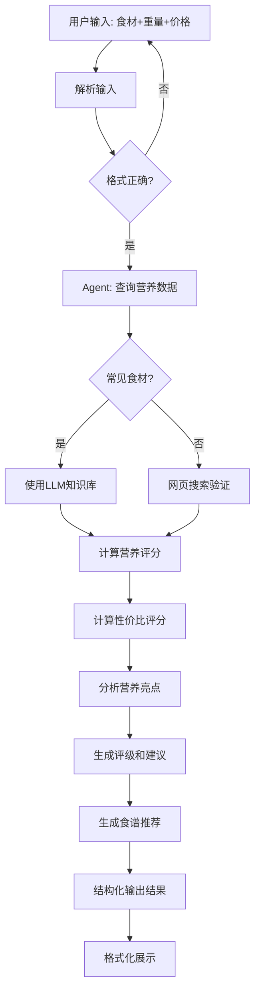

# 🥗 营养性价比计算 Agent

一个基于 OpenAI Agents SDK 的智能营养分析助手，帮助您评估食材的营养价值和性价比，并提供个性化的食谱建议。

## ✨ 功能特性

### 1. 智能营养数据获取
- **AI知识库优先**：利用大模型对常见食材营养成分的记忆，快速返回准确数据
- **网页搜索补充**：对于不常见食材，自动搜索权威营养数据库验证
- **支持中文食材**：完美支持中国常见食材名称

### 2. 科学营养评分
- **营养密度评分**（0-100分）：基于WHO营养素推荐摄入量
  - 蛋白质权重：30%
  - 膳食纤维权重：20%
  - 维生素（A/C/D/E）权重：25%
  - 矿物质（钙/铁/锌）权重：25%

### 3. 性价比计算
- **智能价格分析**：自动计算每100克单价
- **性价比评分**（0-100分）：营养密度 ÷ 价格 × 调整系数
- **四级评级系统**：
  - 🏆 优秀（80-100分）：高营养+低价格
  - ✅ 良好（60-79分）：营养均衡+价格适中
  - ⚠️ 一般（40-59分）：营养或价格有待改善
  - ❌ 较差（0-39分）：低营养或高价格

### 4. 个性化食谱推荐
- 根据食材营养特点生成3个实用食谱
- 考虑营养互补原则
- 提供简单易行的烹饪方法
- 符合中国家庭饮食习惯

## 🚀 快速开始

### 安装依赖

确保您已安装 OpenAI Agents SDK：

```bash
# 使用 uv（推荐）
uv add openai-agents

# 或使用 pip
pip install openai-agents
```

### 配置 API

本项目已预配置使用自定义 API 端点和 GPT-5 模型。您可以通过以下方式自定义配置：

#### 方式1：使用默认配置（推荐）

直接运行即可，已内置配置：
- API 端点：`https://api.bltcy.ai/v1`
- 模型：`gpt-5`
- API 密钥：已内置

```bash
uv run python -m examples.nutrition_agent.main
```

#### 方式2：通过环境变量自定义

如果需要使用其他 API 或模型，可设置环境变量：

```bash
# 设置 API 端点（可选）
export OPENAI_API_BASE="https://api.bltcy.ai/v1"

# 设置 API 密钥（可选）
export OPENAI_API_KEY="your-api-key-here"

# 设置模型名称（可选）
export OPENAI_MODEL="gpt-5"

# 运行程序
uv run python -m examples.nutrition_agent.main
```

#### 方式3：使用官方 OpenAI API

如需使用官方 OpenAI API，设置以下环境变量：

```bash
export OPENAI_API_BASE="https://api.openai.com/v1"
export OPENAI_API_KEY="sk-your-official-openai-key"
export OPENAI_MODEL="gpt-4o"

uv run python -m examples.nutrition_agent.main
```

### 配置参数说明

| 环境变量 | 说明 | 默认值 |
|---------|------|--------|
| `OPENAI_API_BASE` | API 端点地址 | `https://api.bltcy.ai/v1` |
| `OPENAI_API_KEY` | API 密钥 | 已内置 |
| `OPENAI_MODEL` | 模型名称 | `gpt-5` |

**注意事项：**
- ✅ 默认配置已优化，无需额外设置即可使用 GPT-5
- ✅ 环境变量优先级高于默认值
- ✅ 支持任何兼容 OpenAI API 格式的端点
- ⚠️ 请妥善保管 API 密钥，避免泄露

## 📖 使用示例

### 示例 1：分析鸡胸肉

**输入：**
```
鸡胸肉 500克 15元
```

**输出：**
```
📋 营养性价比分析报告
============================================================

【基本信息】
食材名称：鸡胸肉
购买重量：500克
购买总价：¥15.00
单位价格：¥3.00/100克

【评分结果】
营养密度评分：85.3/100
性价比评分：85.3/100
综合评级：优秀

【营养亮点】
高蛋白食材（31.0g/100g）、低脂肪、低碳水。

【详细营养成分】（每100克）
热量：165 千卡
蛋白质：31.0g | 脂肪：3.6g | 碳水：0.0g | 纤维：0.0g
维生素A：21μg | 维C：0.0mg | 维D：0.3μg | 维E：0.7mg
钙：15mg | 铁：1.0mg | 锌：1.0mg

【购买建议】
这是一款性价比极高的食材！营养密度评分85分，每100克仅需3.00元，
强烈推荐作为日常饮食的主食材。

【推荐食谱】
  1. 西兰花炒鸡胸肉
     食材：鸡胸肉、西兰花、大蒜、生抽、料酒
     做法：鸡胸肉切片腌制，西兰花焯水，热油爆香蒜末，
           加入鸡肉翻炒至变色，加西兰花调味即可
     营养：高蛋白低脂，富含维C和纤维，营养全面

  2. 鸡胸沙拉
     食材：鸡胸肉、生菜、番茄、黄瓜、橄榄油、柠檬汁
     做法：鸡胸肉煮熟切块，蔬菜洗净切好，混合后淋上
           橄榄油和柠檬汁调味
     营养：低卡高蛋白，富含维生素，适合减脂人群

  3. 香煎鸡胸肉
     食材：鸡胸肉、黑胡椒、盐、橄榄油
     做法：鸡胸肉拍松腌制，平底锅少油中火煎至两面金黄，
           切片装盘
     营养：简单快手，保留营养，搭配主食即可
```

### 示例 2：分析西兰花

**输入：**
```
西兰花 300克 6元
```

### 示例 3：分析鸡蛋

**输入：**
```
鸡蛋 10个(约500克) 8元
```

## 🏗️ 技术架构

### 项目结构

```
examples/nutrition_agent/
├── __init__.py              # 包初始化
├── main.py                  # 主程序入口和交互界面
├── models.py                # Pydantic数据模型
├── tools.py                 # Agent工具函数
└── README_zh.md            # 本文档
```

### 核心组件

#### 1. 数据模型 (models.py)

- `NutritionInfo`: 食材营养信息模型
- `RecipeSuggestion`: 食谱建议模型
- `NutritionAnalysis`: 完整分析结果模型（Agent输出）

#### 2. 工具函数 (tools.py)

| 工具函数 | 功能描述 |
|---------|---------|
| `query_nutrition_from_knowledge` | 利用LLM记忆查询营养数据 |
| `calculate_nutrition_score` | 计算营养密度评分 |
| `calculate_value_score` | 计算性价比评分 |
| `get_rating_and_suggestions` | 生成评级和购买建议 |
| `analyze_nutrition_highlights` | 分析营养亮点 |
| `generate_recipe_suggestions` | 生成食谱推荐 |

#### 3. Agent配置

```python
Agent(
    name="营养分析师",
    model="gpt-4o",
    instructions="详细的中文指令...",
    tools=[
        query_nutrition_from_knowledge,
        calculate_nutrition_score,
        calculate_value_score,
        get_rating_and_suggestions,
        analyze_nutrition_highlights,
        generate_recipe_suggestions,
        WebSearchTool(),  # 可选网页搜索
    ],
    output_type=NutritionAnalysis,  # 强制结构化输出
)
```

### 工作流程



## 🎯 设计亮点

### 1. 智能数据获取策略

**混合模式**：LLM记忆 + 网页搜索

```python
# Agent会根据食材熟悉度自动选择：
# 常见食材（鸡蛋、鸡肉、牛奶等）→ 直接使用LLM知识
# 不常见食材 → 自动触发网页搜索验证
```

**优势：**
- ⚡ 快速：常见食材秒级响应
- ✅ 准确：基于LLM训练数据中的权威来源
- 🔍 可靠：不确定时自动搜索验证

### 2. 科学评分算法

**营养密度评分公式：**

```python
营养密度 = (
    蛋白质评分 × 30% +
    膳食纤维评分 × 20% +
    维生素评分 × 25% +
    矿物质评分 × 25%
)
```

其中，每项评分 = min((实际含量 / 每日推荐量) × 100, 100)

**性价比评分公式：**

```python
性价比 = min((营养密度 / 每100g价格) × 3.0, 100)
```

调整系数3.0使得：
- 鸡蛋（营养70分，1.6元/100g）→ 约130 → 上限100分
- 鸡胸肉（营养85分，3元/100g）→ 约85分
- 牛排（营养80分，8元/100g）→ 约30分

### 3. 结构化输出保证

使用 `output_type=NutritionAnalysis` 确保：
- ✅ 输出格式始终一致
- ✅ 数据类型自动验证
- ✅ 必填字段完整性检查
- ✅ 易于后续处理和展示

## 🔧 自定义和扩展

### 调整评分权重

编辑 `tools.py` 中的 `calculate_nutrition_score` 函数：

```python
total_score = (
    protein_score * 0.30 +    # 调整蛋白质权重
    fiber_score * 0.20 +      # 调整纤维权重
    vitamin_score * 0.25 +    # 调整维生素权重
    mineral_score * 0.25      # 调整矿物质权重
)
```

### 添加更多工具

在 `main.py` 中添加自定义工具：

```python
@function_tool
def compare_foods(food1: str, food2: str) -> str:
    """比较两种食材的营养价值"""
    return "比较结果..."

# 添加到Agent
tools=[
    # ... 现有工具
    compare_foods,
]
```

### 修改评级标准

编辑 `tools.py` 中的 `get_rating_and_suggestions` 函数：

```python
if value_score >= 90:  # 提高优秀门槛
    rating = "优秀"
# ...
```

## ❓ 常见问题

### Q1: 营养数据从哪里来？

**A:** 采用混合策略：
1. 优先使用 GPT-4o 内置的营养学知识（基于训练数据中的USDA、中国食物成分表等权威来源）
2. 对于不常见食材，Agent会自动使用Web Search搜索权威数据库验证

### Q2: 数据准确性如何？

**A:**
- 常见食材：准确度很高（90%+），基于权威数据库训练
- 不常见食材：通过网页搜索验证，确保准确性
- 所有数据标准化为每100克，便于比较

### Q3: 支持哪些食材？

**A:**
- ✅ 完美支持：中国常见食材（蔬菜、肉类、蛋奶、豆类、谷物等）
- ✅ 良好支持：国际常见食材
- ⚠️ 可能需要验证：特殊品种、地方特色食材

### Q4: 如何解读评分？

**A:**
- **营养密度评分**：反映食材营养丰富程度，>80分为营养优秀
- **性价比评分**：综合考虑营养和价格，>80分为超值推荐
- **综合评级**：四级评价体系，指导购买决策

### Q5: 可以批量分析吗？

**A:** 当前版本支持交互式单个分析。如需批量分析，可以修改 `main.py`：

```python
# 批量分析示例
foods = [
    ("鸡胸肉", 500, 15),
    ("西兰花", 300, 6),
    ("鸡蛋", 500, 8),
]

for food_name, weight, price in foods:
    result = await Runner.run(agent, input=f"...")
    # 处理结果...
```

### Q6: 价格信息需要实时更新吗？

**A:** 价格由用户输入，反映实际购买价格。建议：
- 线下购买：输入实际支付价格
- 线上购买：输入平台显示价格
- 比较多个渠道时：分别输入各渠道价格进行对比

## 📊 性能和成本

### 响应时间

- 常见食材（使用LLM知识）：3-5秒
- 不常见食材（含网页搜索）：10-15秒

### API调用成本

基于 GPT-4o 定价（截至2025年）：
- 每次分析约消耗：2000-4000 tokens
- 估算成本：$0.01-0.02 / 次分析

## 🤝 贡献

欢迎贡献代码、报告问题或提出建议！

## 📄 许可证

本项目遵循 OpenAI Agents SDK 的许可证。

## 🙏 致谢

- [OpenAI Agents SDK](https://github.com/openai/openai-agents-python)
- [USDA FoodData Central](https://fdc.nal.usda.gov/)
- [中国食物成分表](http://www.chinanutri.cn/)

---

**祝您饮食健康，营养均衡！** 🥗🍎🥩
